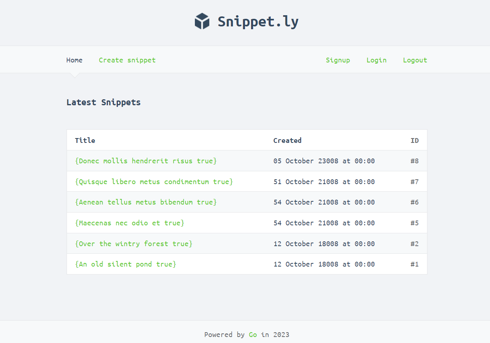

# Snippetly - Share Favourite Code Snippets 



Snippetly is a web application designed to facilitate the storage and retrieval of code snippets, functioning similarly to Pastebin. This project encompasses features such as user authentication, dynamic HTML rendering, session management, web security, and more, providing a comprehensive platform for managing and sharing code snippets.

## Key Features

- Create and view code snippets effortlessly.
- Efficiently manage requests through middleware.
- Implement RESTful routing for streamlined endpoint management.
- Ensure secure connections using an SSL/TLS web server with HTTP 2.0.
- Enable user authentication, allowing hassle-free sign-up and login.
- Enhance debugging with detailed leveled logging.
- Safeguard data integrity via MySQL database integration.
- Generate dynamic HTML content with the flexibility of Go templates.
- Manage user interactions and data with efficient session handling.
- Ensure top-notch web security measures are in place.

## Getting Started

### Prerequisites

To work on this project, make sure you have the following software installed:

- Go 1.13+ (with Go modules support)
- MySQL
- make

### Installation and Setup

1. Clone the project repository and navigate to the project directory:

```sh
$ git clone https://github.com/wizenheimer/snippetbox
$ cd snippetbox
```

2. Generate the necessary TLS key and certificate for secure HTTPS:

```sh
$ make cert
```

3. Initiate the local web server, serving over HTTPS on port 4000:

```sh
$ make dev
```

### Running Tests

Execute the following command to run tests:

```sh
$ make test
```

### Dependencies

While the core of this project relies on the powerful Go standard library for web development, certain external packages are introduced for security enhancements and managing complexity.

### Recommended Enhancements

Feel free to explore the following enhancements to take the project further:

- Integrate an informative "About" page into the website.
- Bolster test coverage with a comprehensive set of unit and integration tests.
- Create a dedicated API endpoint to facilitate JSON representation of snippets.
- Strengthen user experience with email confirmation during sign-up.
- Implement a secure password reset functionality for users.
- Develop a convenient command-line utility (`cmd/cli`) for efficient database administration tasks.

## Licensing

This project operates under the [MIT License](LICENSE) for open and permissive usage.